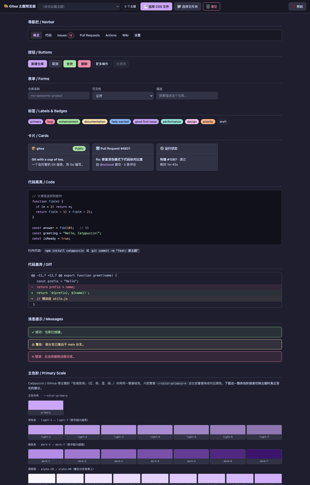

# 🎨 Gitea 主题预览器（gitea-theme-picker）

   

一个用于预览和对比 Gitea 主题的纯前端工具——**纯静态 HTML · 无后端 · 无网络请求 · 无数据上传**。

English below | 一个纯前端单文件工具：加载本地 Gitea 主题 CSS 文件，实时预览、对比与调色。

## 📸 截图



## ✨ 特性

- **多种加载方式**：选择 CSS 文件 / 选择文件夹 / 直接拖拽（支持整个目录递归遍历，WebkitEntry API）
- **主题自动分组**：按文件名识别系列（GitHub / Catppuccin / Tokyo Night / Dracula / Nord 等），自动解析为中文名并分组显示
- **`@import` 依赖解析**：Auto 主题引用的 `latte` / `mocha` 等依赖文件同目录优先自动拼接
- **主色阶展示**：`light-1→7` / `dark-1→7` / `alpha-10→90` 完整色阶，切换主题实时更新
- **派生色实际用途示例**：淡色徽章、聚焦光晕、选中列表项、按钮三态、引用块等真实 UI 演示
- **变量速览表 + 完整调色板**：当前主题生效的全部 `--color-*` 变量
- **内置帮助面板**：使用说明 + 开发定制指南（新增系列、风味分组、色调中文名等 6 个常用定制点）

## 🚀 使用方法

方式一（本地）：双击 `gitea-theme-picker.html` 即可，无需服务器、无需安装。

方式二（在线体验）：[https://skyares.github.io/gitea-theme-picker/gitea-theme-picker.html](https://skyares.github.io/gitea-theme-picker/gitea-theme-picker.html)（GitHub Pages，主题文件同样只在你自己的浏览器里加载，不上传）。

## 📛 主题文件命名规则

```text
theme-<系列>-<风味>-<色调>[-auto].css
```

示例：

```text
theme-catppuccin-mocha-mauve.css    → 🎨 Catppuccin / 🌑 Mocha / 淡紫
theme-github-high-contrast-dark.css → 🐙 GitHub · 高对比 / 深色
theme-auto.css                      → 🏠 Gitea 基础 / 自动
```

## ⚠️ 已知限制

- 单文件上传无法区分同名文件（两个 `theme-dark.css` 会互相覆盖）→ 用文件夹上传/拖拽
- `@import` 依赖需一起加载，缺文件会回退到按原样加载
- 不支持远程 URL 主题（出于 CORS 考虑，必须是本地文件）

## 🔧 技术栈

纯原生实现，零依赖、零构建：

- **HTML5 + CSS3** —— CSS 变量驱动主题切换
- **Vanilla JavaScript** —— 无框架、无构建、无打包
- **File API + Blob URL** —— 本地加载与解析 CSS
- **WebkitEntry API** —— 拖拽目录递归遍历

依赖 Gitea 官方主题变量规范（`--color-body` / `--color-text` / `--color-primary` / `--color-nav-bg` / `--color-light-border` 等）。

## 👥 制作团队

| 成员 | 角色 |
|---|---|
| **skyares** | 原作者 / 维护者 |
| **DeepSeek** | AI 协作开发（架构设计、主题识别逻辑、`@import` 解析、拖拽目录处理、帮助文档撰写） |

## 📜 开源许可

[MIT License](./LICENSE) —— 可自由使用、修改、分发、商用，唯一要求保留原始版权声明。

## 🔄 仓库镜像

- GitHub：<https://github.com/skyares/gitea-theme-picker>

---

Made with 🎨 by skyares & DeepSeek · MIT License · 2026

## 🇬🇧 English

**gitea-theme-picker** — a single-file, zero-dependency, purely front-end theme previewer for [Gitea](https://gitea.com).

Load your local Gitea theme CSS files (via file picker, folder picker or drag & drop), and instantly preview them on a Gitea-style UI mock: navbar, buttons, forms, labels, cards, code highlighting, diffs, messages, primary color scale (`light`/`dark`/`alpha`), derived-color usage demos and a full palette.

- **No server, no build, no network requests, no data upload** — everything stays in your browser
- Auto-groups themes by series (GitHub / Catppuccin / Tokyo Night / Dracula / Nord …) with Chinese display names
- Resolves `@import` dependencies (same directory first)
- Built-in help panel with customization guide (add series, flavors, tint keywords …)

Usage: open `gitea-theme-picker.html` locally, or try it online: <https://skyares.github.io/gitea-theme-picker/gitea-theme-picker.html> (GitHub Pages; theme files are still loaded only in your own browser). Works with standard Gitea CSS variables (`--color-body`, `--color-primary`, `--color-nav-bg`, …).

**Keywords**: gitea theme, gitea 主题, gitea css theme previewer, gitea custom theme, gitea theme tester, catppuccin gitea, 自托管 Git 主题预览
